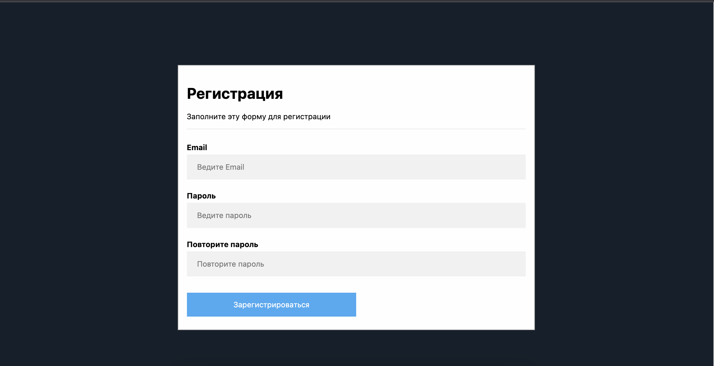
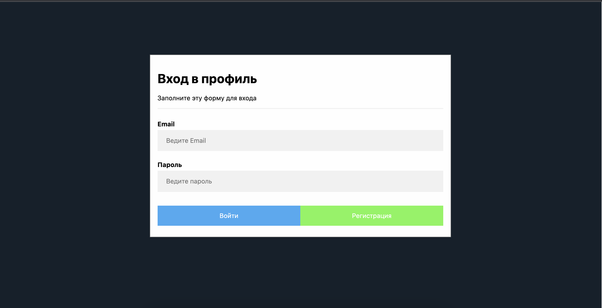
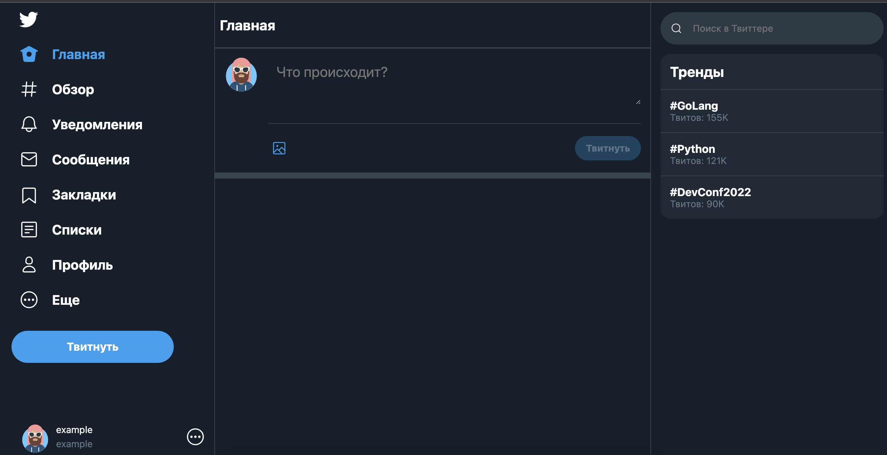
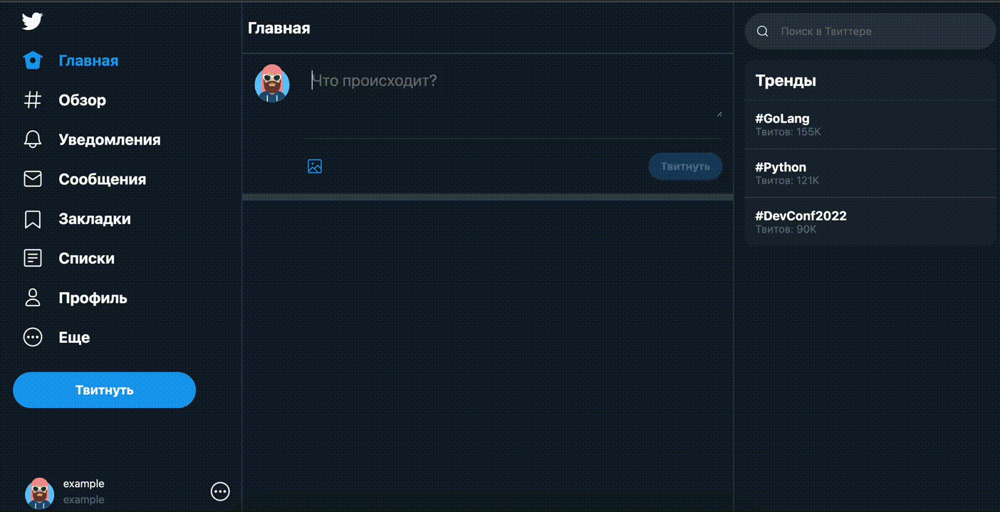
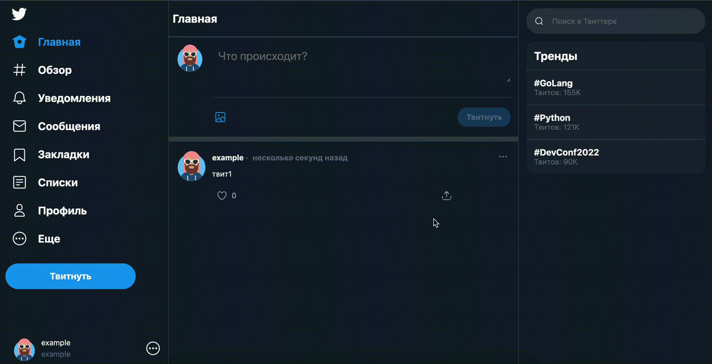
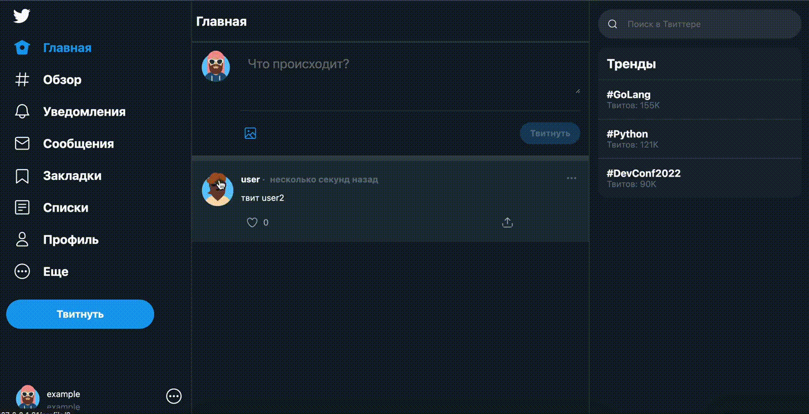
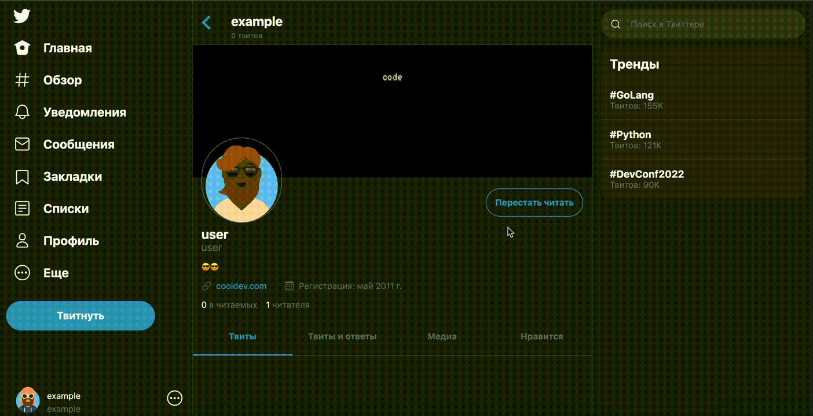
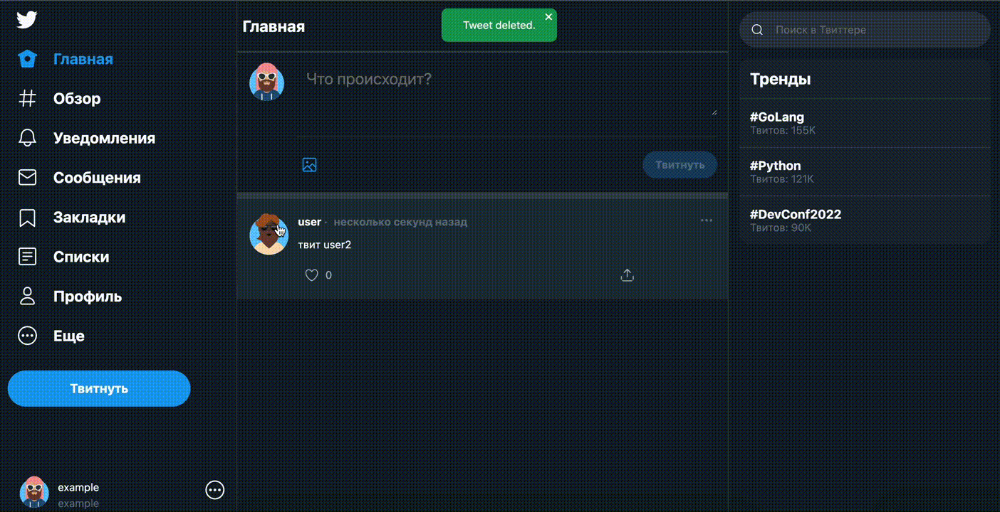

<h1 align="center">CloneTweeter</h1>
Данный сервис является клоном Tweeter

Бэкенд реализован на фреймворке FastApi. База данных PostgreSQL.
Так же в сервисе есть мониторинг работы приложения

## Основой функционал приложения:

1. Регистрация и авторизация пользователя
2. Зарегистрированный пользователь может добавить и удалить твит, добавить картинку к твиту
3. Зарегистрированный пользователь может подписаться на другого пользователя
4. Зарегистрированный пользователь может отписаться от другого пользователя
5. Зарегистрированный пользователь может лайкнуть твит другого пользователя.
6. Пользователь может убрать отметку «Нравится».
7. Пользователь может посмотреть профиль другого пользователя 

### 1. Регистрация и авторизация пользователя
Для регистрации используется email и пароль

<p align="center">

</p>

После регистрации в базе данных появится информация о пользователе и будет возможность зайти на сервис
с почтой и паролем

<p align="center">

</p>

Основная страница:
<p align="center">

</p>


### 2. Добавление и удаление твита
Твит добавляется на главной станице нажатием кнопки "Твитнуть"
<p align="center">

</p>

Удаление твита возможно выбором в меню твита, пункта "Удалить"
<p align="center">

</p>

Добавление картинки
<p align="center">

</p>

### 3. Добавление подписки на другого пользователя
<p align="center">

</p>

### 4. Удаление подписки на другого пользователя
<p align="center">

</p>

### 5. Лайк твита
<p align="center">

</p>

### 6. Удаление лайка твита
<p align="center">

</p>

### 7. Просмотр профиля другого пользователя 
<p align="center">

</p>

### 8. Просмотр своего профиля 
<p align="center">

</p>


## Перед первым запуском
Необходимо переименовать .env.template в .env и внести необходимые данные
## Первый запуск сервиса
```
docker compose up --build -d
```
## Повторный запуск
```
docker compose up -d
```
После этого сервис будет доступен по адресу http://127.0.0.1:81/, если запускать локально,
или по адресу http://ip_server:81/, если запускать на сервере

## Остановка сервиса
```
docker compose down
```

Подробная Swagger документация по api сервиса 
доступна по адресу http://127.0.0.1:8000/docs или http://ip_server:8000/docs

Перед выполнением запросов в Swagger нужно сначала зарегистрироваться и использовать полученный ApiKey
<p align="center">

</p>

Либо войти и получить существующий ApiKey из базы данных
<p align="center">

</p>